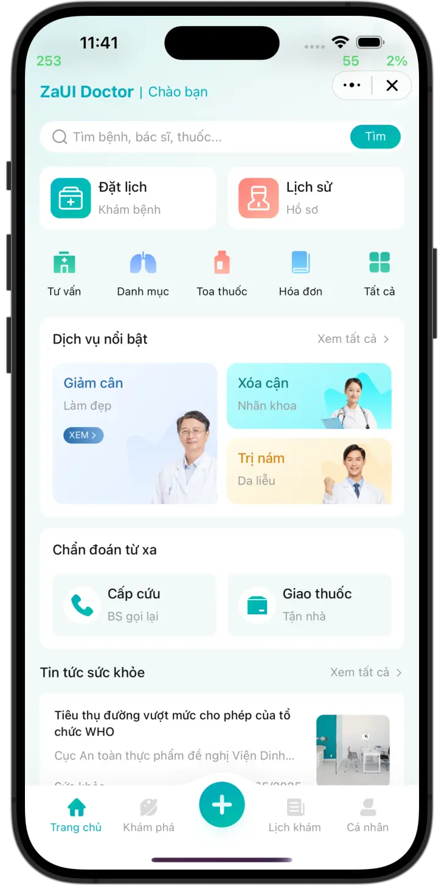
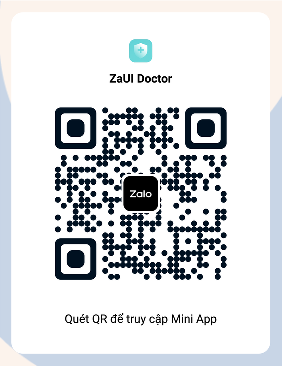
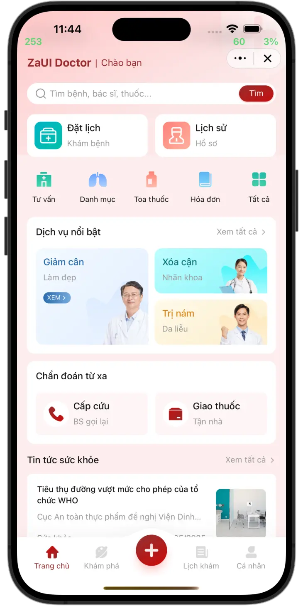
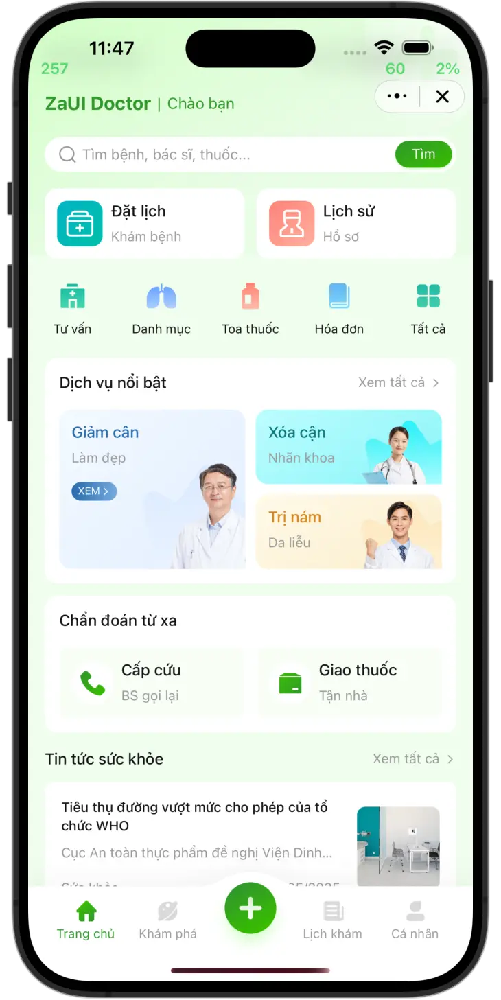
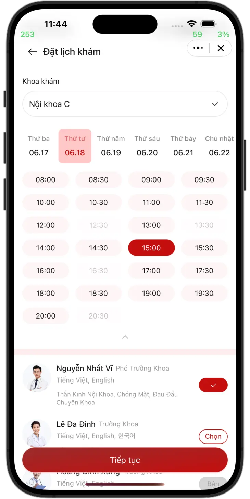
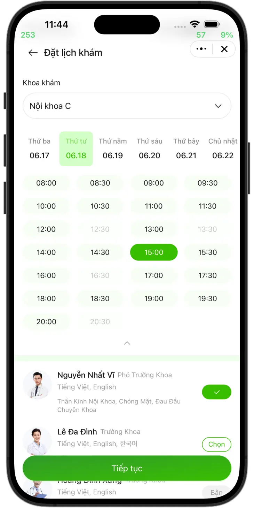

# KajoTai Rehab Clinic - Zalo Mini App

🏥 **Hệ thống đặt lịch khám chữa bệnh trực tuyến** cho phòng khám phục hồi chức năng KajoTai

## 📱 Tính năng chính

### **🔥 User App (Zalo Mini App)**
- ✅ Đặt lịch khám nhanh chóng
- ✅ Chọn bác sĩ và thời gian phù hợp  
- ✅ Xem lịch sử đặt lịch
- ✅ Tích hợp thanh toán Zalo Pay
- ✅ Nhận thông báo từ Zalo OA

### **🏥 Reception System**  
- ✅ Dashboard quản lý booking real-time
- ✅ Approve/Reject appointment
- ✅ Check-in khách hàng
- ✅ Xem thống kê theo ngày

### **� Backend Integration**
- ✅ Supabase PostgreSQL database  
- ✅ Real-time synchronization
- ✅ QR Code generation
- ✅ Authentication & Authorization
- **User Authentication System** - Zalo integration with development/production modes
- **Complete Booking Flow** - 3-step booking with QR code generation  
- **Database Schema** - Supabase integration with mock database fallback
- **Status Management** - Comprehensive appointment status workflow
- **Error Handling** - Production-ready error boundaries and fallbacks
- **System Diagnostics** - Real-time health monitoring and debugging tools

| Preview | Feature |
|---------|---------|
|  | Booking System |
|  | QR Check-in |

## 🎯 Real Clinic Workflow Integration

**Customer Journey:**
```
Facebook/Zalo Chat → Mini App Link → Booking Form → Confirmation → 
Visit Clinic → QR Scan → Check-in → Treatment
```

### **Core Features:**
- 📱 **Complete Booking System** - Multi-step appointment scheduling
- 🔐 **Zalo Authentication** - Seamless user login with Zalo ID
- 📊 **Status Management** - Pending → Confirmed → Checked-in → Completed
- 🔲 **QR Code Generation** - For clinic check-in system
- 📈 **System Diagnostics** - Real-time system health monitoring
- ⚕️ **Healthcare Data** - HIPAA-compliant data handling

### **Advanced Features:**
- 🔄 **Auto Status Updates** - Automatic no-show detection
- 📱 **Reception Dashboard** - Staff management interface (Week 3-4)
- 📸 **Media Uploads** - Image/video symptom attachments (Week 5-6)
- 🔔 **Notifications** - SMS/Zalo OA integration (Week 5-6)

## 📅 **Development Timeline**

### ✅ **Week 1-2: Foundation (COMPLETE)**
- User authentication and ID consistency
- Complete booking flow with error handling
- Database schema with Supabase integration
- Status management system

### 🔄 **Week 3-4: Reception System (IN PROGRESS)**
- Reception web app for staff
- QR scanner for patient check-in
- Real-time status synchronization

### 📋 **Week 5-6: Advanced Features**
- Media upload system for symptoms
- SMS and Zalo OA notifications
- Analytics dashboard

### 🚀 **Week 7-8: Production Deployment**
- Load testing and optimization
- Production environment setup
- Staff training and documentation

## Setup

### Using Zalo Mini App Extension

1. Install [Visual Studio Code](https://code.visualstudio.com/download) and [Zalo Mini App Extension](https://mini.zalo.me/docs/dev-tools).
1. Click on **Create Project** > Choose **ZaUI Doctor** template > Wait until the generated project is ready.
1. **Configure App ID** and **Install Dependencies**, then navigate to the **Run** panel > **Start** to develop your Mini App 🚀

### Using Zalo Mini App CLI

> **Note:** Vite 5 compatibility in CLI is under development. Until then, please use the Zalo Mini App Extension.

1. [Install Node JS](https://nodejs.org/en/download/).
1. [Install Zalo Mini App CLI](https://mini.zalo.me/docs/dev-tools/cli/intro/).
1. **Download** or **clone** this repository.
1. **Install dependencies**:
   ```bash
   npm install
   ```
1. **Start** the dev server using `zmp-cli`:
   ```bash
   zmp start
   ```
1. **Open** `localhost:3000` in your browser and start coding 🔥

### Using Zalo Mini App Studio

This template is built using **Vite 5.x**, which is **not compatible** with Zalo Mini App Studio.

## Deployment

1. **Create** a Zalo Mini App ID. For instructions, please refer to the [Coffee Shop Tutorial](https://mini.zalo.me/tutorial/coffee-shop/step-1/).

1. **Deploy** your mini program to Zalo using the ID created.

   If you're using Zalo Mini App Extension: navigate to the Deploy panel > Login > Deploy.

   If you're using `zmp-cli`:

   ```bash
   zmp login
   zmp deploy
   ```

1. Scan the **QR code** using Zalo to preview your mini program.

## Usage

The repository contains sample UI components and features for building your healthcare application. You may modify the code to suit your specific healthcare needs.

Here are some recipes and instructions on how to customize the application.

### Register a new page

To register a new page:

1. Create a new folder in `src/pages/`.
2. Create an `index.tsx` file containing a `*Page` component.
3. Register the page in `src/router.tsx`:

   ```tsx
   {
      path: "/payment-result",
      element: <PaymentResultPage />,
      handle: {
         back: true, // If the page has a back button
         title: "Giao dịch hoàn tất", // The title to be shown on the header
      },
   }
   ```

4. Sections of a page can be split into components in the same folder. For example: `src/pages/payment-result/tab1.tsx`, `src/pages/payment-result/tab2.tsx`,...

### Load data from your server

Data are loaded into view using Jotai's state, called [atoms](https://jotai.org/docs/core/atom). You can change how data are loaded without changing the UI by replacing `src/state.ts`:

```diff
- export const doctorsState = atom<Promise<Doctor[]>>(mockDoctors);
+ export const doctorsState = atom<Promise<Doctor[]>>(async () => {
+   const response = await fetch("https://");
+   return response.json();
+ });
```

As long as the new data satisfies the given TypeScript interface (for example, `Doctor`), no changes to the UI are required. Otherwise, feel free to refactor the interfaces and the UI to suit your DTO.

### Handle form submission

Modify the `onSubmit` logic in the form you want to handle submission. For example:

```diff tsx filename="src/pages/booking/step2.tsx"
onSubmit={async () => {
-   await wait(1500);
-   promptJSON(formData);
+   const response = await fetch("https://", {
+      method: "POST",
+      headers: {
+      "Content-Type": "application/json",
+      },
+      body: JSON.stringify(formData),
+   });
   navigate("/booking/3", {
      viewTransition: true,
   });
}}
```

### Change header title

Modify `app-config.json` > `app.title` field.

```json
{
   "app": {
      "title": "ZaUI Doctor",
```

### Change OA ID

There is a CTA block to chat with Zalo OA. To change the Zalo OA for chat, modify `app-config.json` > `template.oaID` field:

```json
{
   "template": {
      "name": "zaui-doctor",
      "oaID": "4318657068771012646"
```

### Customization

This template can be customized by changing 5 main colors in `src/css/app.scss`:

```css
:root {
  --primary: #00abbb;
  --primary-gradient: #00bead;
  --highlight: #01bdaf1a;
  --background: #f2f9f9;
  --disabled: #9a9a9a;
}
```

| `--primary: #31992c`                      | `--primary: #992c2c`                          |
| ----------------------------------------- | --------------------------------------------- |
|          |          |
|  |  |

---

*This project is part of the KatiNat clinic management system - integrating Zalo Mini App for patients and web-based reception system for healthcare providers.*
