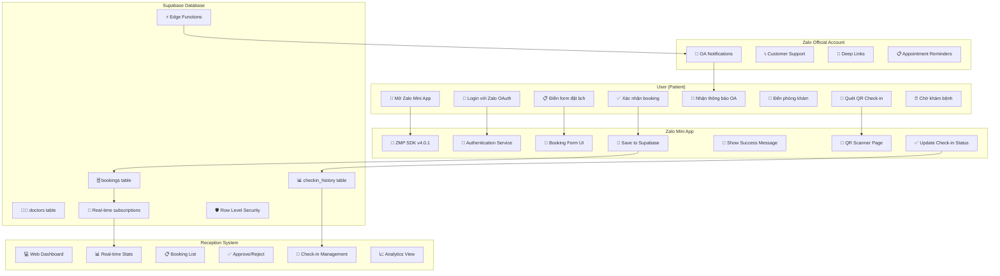

# 🏊‍♂️ KajoTai Rehab Clinic - Swimlane Diagram

## System Architecture Overview



## 🔄 Process Flow Swimlane

| 👤 **User** | 📱 **Zalo Mini App** | 💾 **Supabase** | 🏥 **Reception** | 📨 **Zalo OA** |
|-------------|---------------------|------------------|------------------|-----------------|
| Mở Mini App | ▼ | | | |
| | ZMP SDK khởi tạo | ▼ | | |
| | | Load cấu hình | | |
| Login Zalo | ▼ | | | |
| | OAuth 2.0 flow | ▼ | | |
| | | Xác thực user | | |
| Chọn khoa khám | ▼ | | | |
| | Hiển thị doctors | ▼ | | |
| | | Query doctors table | | |
| Chọn ngày/giờ | ▼ | | | |
| | Kiểm tra slot trống | ▼ | | |
| | | Check time conflicts | | |
| Điền thông tin | ▼ | | | |
| | Validate form data | | | |
| Xác nhận đặt lịch | ▼ | | | |
| | Gửi booking request | ▼ | | |
| | | Insert bookings record | | |
| | | Trigger Edge Function | ▼ | |
| | | | | Gửi OA message |
| Nhận thông báo | | | | ▼ |
| | | Real-time update | ▼ | |
| | | | Dashboard refresh | |
| Đến phòng khám | | | | |
| Quét QR check-in | ▼ | | | |
| | Deep link → Check-in page | ▼ | | |
| | | Update checkin_status | | |
| | | Real-time sync | ▼ | |
| | | | Show check-in list | |

## 🏗️ Technical Architecture

### **Frontend Stack**
```
📱 Zalo Mini App (React + TypeScript)
├── 🎨 UI Components (Tailwind CSS)
├── 🛣️ React Router (SPA Navigation)  
├── 🔐 Authentication (Zalo OAuth)
├── 📡 API Services (Supabase Client)
└── 🎯 State Management (React Hooks)
```

### **Backend Stack**
```
💾 Supabase Platform
├── 🗄️ PostgreSQL Database
├── 🔄 Real-time Subscriptions
├── 🛡️ Row Level Security (RLS)
├── ⚡ Edge Functions (TypeScript)
├── 🔐 Authentication & Authorization
└── 📊 Analytics & Monitoring
```

### **Integration Points**
```
🔗 External Integrations
├── 📱 Zalo Mini App SDK v4.0.1
├── 📨 Zalo Official Account API
├── 💳 Zalo Pay SDK (future)
├── 📧 Email Notifications (future)
└── 📊 Analytics Tracking (future)
```

## 🛡️ Security Architecture

### **Authentication Flow**
1. **User Login**: Zalo OAuth 2.0 → JWT Token
2. **API Calls**: Bearer Token với Supabase
3. **Admin Operations**: Service Role Key (reception)
4. **Data Access**: Row Level Security policies

### **Data Protection**
- 🔐 Environment variables untuk credentials
- 🛡️ RLS policies untuk data isolation  
- 🔒 HTTPS/WSS untuk semua communications
- 🎭 QR codes encrypted dengan AES-256

## 📊 Database Schema

### **Core Tables**
```sql
bookings (25+ records)
├── id: UUID (Primary Key)
├── customer_name: TEXT
├── phone_number: TEXT  
├── user_id: TEXT (Zalo User ID)
├── appointment_date: DATE
├── appointment_time: TIME
├── booking_status: ENUM(pending, confirmed, cancelled)
├── checkin_status: ENUM(not_arrived, checked_in, no_show)
└── qr_code_data: TEXT (encrypted)

doctors
├── id: SERIAL (Primary Key)
├── name: TEXT
├── specialties: TEXT[]
├── available_times: JSONB
└── is_active: BOOLEAN

checkin_history
├── id: UUID (Primary Key) 
├── booking_id: UUID (FK)
├── checkin_timestamp: TIMESTAMPTZ
├── staff_id: TEXT
└── notes: TEXT
```

## 🚀 Deployment Architecture

### **Development Environment**
```bash
🔧 Local Development
├── ZMP CLI: zmp start --port 8081
├── Reception: file://reception-clean.html
├── Database: Supabase Cloud (vekrhqotmgszgsredkud)
└── Hot Reload: Vite dev server
```

### **Production Environment**
```bash
🌐 Production Deployment
├── Mini App: zmp deploy → Zalo Platform
├── Reception: Static hosting (GitHub Pages/Netlify)
├── Database: Supabase Production
└── CDN: Static assets caching
```

---

# 👥 PARTNER ONBOARDING GUIDE

## 🎯 Untuk Developer yang join project

### **📋 Prerequisites Knowledge**
- **Frontend**: React 18, TypeScript, Tailwind CSS
- **Mobile**: Zalo Mini App SDK basics
- **Backend**: Supabase (PostgreSQL, Real-time, Auth)
- **Tools**: Git, VS Code, Node.js 16+

### **🚀 Quick Setup (30 phút)**
```bash
# 1. Clone repository
git clone https://github.com/Kai-D13/Kajo_rehab.git
cd Kajo_rehab

# 2. Install dependencies
npm install

# 3. Setup environment
cp .env.example .env.local
# Điền thông tin Zalo App ID và Supabase credentials

# 4. Run development
zmp start --port 8081

# 5. Test reception system  
start chrome reception-clean.html
```

### **🔑 Credentials cần thiết**
```env
# Zalo Mini App (từ developer.zalo.me)
VITE_ZALO_APP_ID=2403652688841115720
VITE_ZALO_MINI_APP_ID=3355586882348907634

# Supabase (từ supabase.com dashboard)
VITE_SUPABASE_URL=https://vekrhqotmgszgsredkud.supabase.co
VITE_SUPABASE_ANON_KEY=eyJhbGciOiJIUzI1NiIs...
VITE_SUPABASE_SERVICE_ROLE_KEY=eyJhbGciOiJIUzI1NiIs...
```

### **📁 Cấu trúc codebase quan trọng**
```
🎯 Key Files untuk Development:
├── src/services/real-clinic-booking.service.ts  # Core booking logic
├── src/pages/schedule/history.tsx               # User booking history  
├── reception-clean.html                         # Reception dashboard
├── database/production-deploy.sql               # DB schema
└── .env.local                                   # Local config
```

### **🛠️ Development Workflow**
1. **Feature Branch**: `git checkout -b feature/your-feature`
2. **Code Changes**: Edit trong `src/` folder
3. **Test Locally**: `zmp start --port 8081`
4. **Test Reception**: Open `reception-clean.html`
5. **Commit**: `git commit -m "feat: your description"`
6. **Pull Request**: Tạo PR lên main branch

### **🐛 Common Issues & Solutions**
- **Port conflict**: Dùng `--port 8081` atau port khác
- **CORS errors**: Đảm bảo Supabase URL đúng
- **Auth issues**: Check Zalo App ID trong .env.local
- **DB connection**: Verify Supabase credentials

### **📞 Support Channels**
- **GitHub Issues**: Bug reports và feature requests
- **Code Review**: Pull Request discussions  
- **Documentation**: `docs/` folder untuk technical specs
- **Database**: Supabase dashboard untuk monitoring

## 🎯 Untuk Business Partner/Stakeholder

### **📊 Current System Status**
- ✅ **25+ Production Bookings** tested successfully
- ✅ **Real-time Reception System** working
- ✅ **Zalo Integration** authenticated and active
- ✅ **Database** production-ready with security

### **💰 Business Value Delivered**
- 🚀 **Faster Booking**: 3-minute online booking vs 10-minute phone call
- 📊 **Real-time Dashboard**: Staff can see bookings instantly
- 📱 **Mobile-first**: Zalo integration reaches 70M+ Vietnamese users
- 💾 **Data Analytics**: All booking data tracked for insights

### **🎯 Next Phase Opportunities**
1. **Zalo OA Integration**: Automated notifications (1-2 days)
2. **QR Check-in System**: Contactless patient flow (1 day)  
3. **Payment Integration**: Zalo Pay for deposits (3-5 days)
4. **Analytics Dashboard**: Revenue and patient insights (2-3 days)

### **📈 Scalability Roadmap**
- **Multi-clinic**: Support multiple locations
- **Staff Management**: Doctor scheduling system
- **Patient Records**: Medical history integration
- **Telemedicine**: Video consultation features

---

**🏥 Ready untuk partnership và scaling KajoTai Rehab Clinic system!** 🚀
